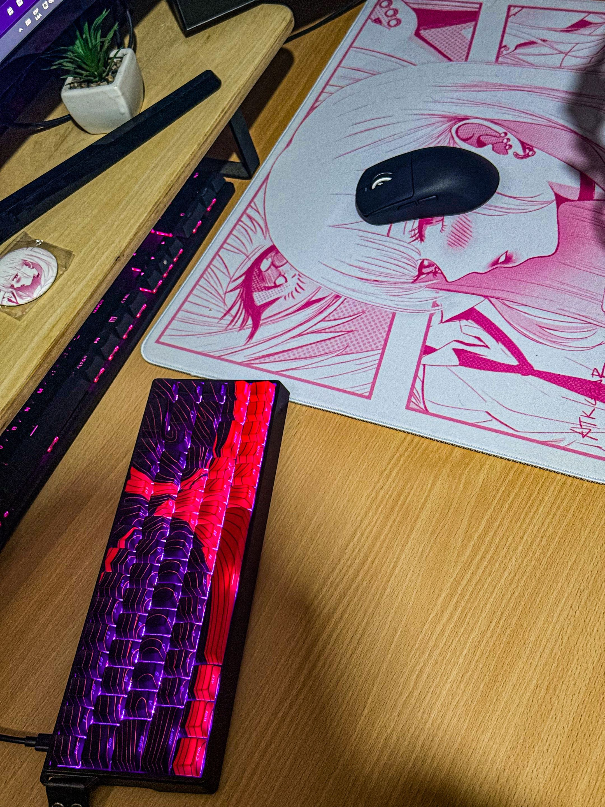
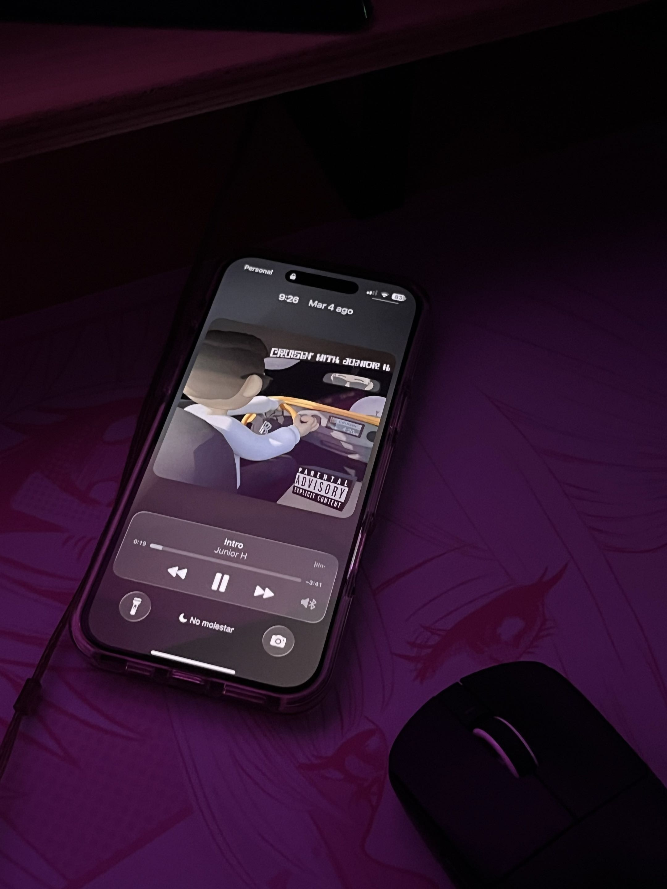

---

## Sobre mí

Armo y mantengo proyectos en cuatro organizaciones: servidores de Minecraft
(HaliaCraft, UranoCraft, Sayer).

También quiero sacar más cosas, pero no me da la vida.

### 🛒 Hago ecommerce y vendo cosas

### 🤖 Todo esto lo hice con IA

*Igual hay que saber qué pedirle.*

**Yo los tengo todos. Vos no.**

*Este README también lo hizo la IA. Y este renglón. Y el de abajo.*

---

## Proyectos

<table align="center">
<tr>
<td align="center" width="33%">
<a href="https://haliacraft.com"><b>HaliaCraft</b> haliacraft.com</a> 
Servidor de Minecraft
</td>
<td align="center" width="33%">
<a href="https://uranocraft.net"><b>UranoCraft</b> uranocraft.net</a> 
Servidor de Minecraft
</td>
<td align="center" width="33%">
<a href="https://sayer.live"><b>Sayer</b> sayer.live</a> 
Servidor de Minecraft
</td>
</tr>
</table>

---

## Organizaciones

<table>
<tr>
<td align="center" width="25%">
<a href="https://github.com/CherryNode"> <b>CherryNode</b></a>
</td>
<td align="center" width="25%">
<a href="https://github.com/HaliaCraft"> <b>HaliaCraft</b></a>
</td>
<td align="center" width="25%">
<a href="https://github.com/EternumLabs"> <b>Eternum Lab's</b></a>
</td>
<td align="center" width="25%">
<a href="https://github.com/PolaroidStudio"> <b>Polaroid Studio</b></a>
</td>
</tr>
</table>

> **Aclaración sobre Polaroid Studio**
> Ahí está todo el quilombo del DJ, nada de eso es mío.
> A mí me metieron solo para clonar un bot de Discord.

---

## Tecnologías

**Lenguajes**

**Bases de datos**

**Infraestructura**

**Hosting y protección**

---

## Setup

<b>Specs</b> — i9-12900K · RTX 4070 Ti · 64 GB · 3 monitores

 

<table align="center">
<tr><td><b>CPU</b></td><td>Intel Core i9-12900K</td></tr>
<tr><td><b>GPU</b></td><td>NVIDIA GeForce RTX 4070 Ti</td></tr>
<tr><td><b>RAM</b></td><td>64 GB — 4 × 16 GB</td></tr>
<tr><td><b>Monitores</b></td><td>Samsung Odyssey CRG5 24" 240 Hz curvo (principal) · CRG5 24" 144 Hz curvo · Odyssey G30 S24BG30 24" 144 Hz</td></tr>
<tr><td><b>Periféricos</b></td><td>Teclado Aula · HyperX Alloy FPS — Mouse Logitech · ATK — Mousepad ATK Otaku · HyperX</td></tr>
<tr><td><b>Audio</b></td><td>Micrófono HyperX — Auriculares HyperX Cloud II · KZ Castor</td></tr>
</table>

---

## Estadísticas

---

## Contacto

